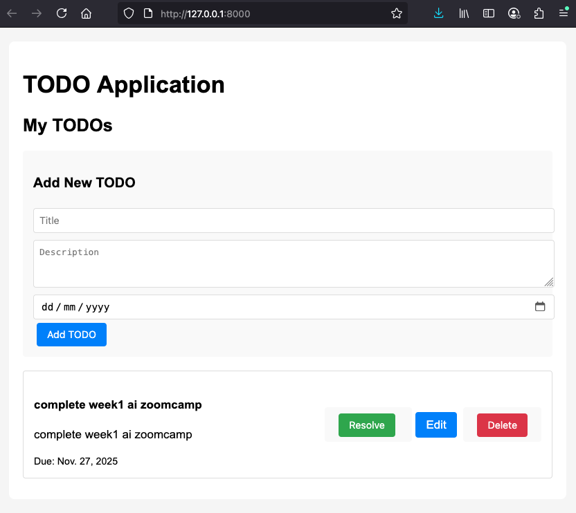

## Setup 
- using claude cli for the week1 homework
- [CLAUDE.md](./CLAUDE.md) contains the context and questions for week1
- uv used for project setup and package management
- [week1/prompt-log.md](./prompt-log.md) contains the prompt history for week1 homework

## Question 1
> Answer : `pip install django` or `uv pip install django`

## Question 2
> Answer : `settings.py`

## Question 3
> Answer : Run migrations

## Question 4
> Answer : views.py

## Question 5
> Answer : `TEMPLATES['DIRS'] in project's settings.py`

## Question 6
> Answer : ` python manage.py test`

## Working Django App
